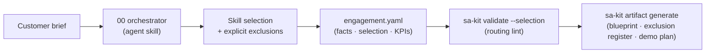

# Databricks SA Dev Kit

**Give your AI agent the judgment of a senior Solution Architect.**

[](https://github.com/jayaprakash87/databricks-sa-toolkit/actions/workflows/ci.yml)
**Version 2.6.0** · 19 skills · works with Claude Code, GitHub Copilot, and Databricks Genie

The SA Dev Kit is a set of composable **agent skills** plus a small **`sa-kit` CLI** that help Solution Architects discover, architect, prove, and communicate Databricks solutions — starting from the customer's business outcome, not from a reference architecture.

---

## Why this exists

AI agents are eager over-engineers. Ask one to design a customer solution and you routinely get medallion layers, CDC pipelines, streaming, and a GenAI chatbot — whether or not the use case needs any of them.

This kit encodes the discipline senior SAs apply instinctively:

| Principle | What the kit enforces |
|---|---|
| **Use-case first** | Every solution starts from the business outcome, persona, decision, and KPI |
| **Explicit exclusions** | What you *don't* build is recorded with a reason — never silently omitted |
| **No forced patterns** | Medallion, CDC, streaming, ML, and GenAI must be justified, or explicitly excluded |
| **Facts vs. hypotheses** | Verified facts, SA hypotheses, and unknowns are kept separate |
| **Databricks-aware, not Databricks-forced** | Coexisting with Snowflake, Fabric, SAP, etc. is a first-class answer |

These aren't guidelines in a slide deck — they are validated by a deterministic routing lint, scored against 16 reference scenarios, and enforced in CI.

## Who it's for

- **Databricks Solution Architects** preparing discovery, architecture, demos, and value cases for customer engagements
- **Partner and customer architects** who want a structured, vendor-honest solution-design method
- **SA leaders** who want consistent, reviewable engagement artifacts across a team

## How it works — the 60-second version



1. You install the **19 skills** into your agent (Claude Code, Copilot, or Genie).
2. The **orchestrator skill (00)** reads a customer brief and composes only the specialist skills the use case needs — recording exclusions with reasons.
3. The result lives in a plain-YAML **engagement file**; the CLI **lints the selection** (silent CDC/streaming/ML/GenAI decisions are blocked) and **generates customer-ready artifacts** from it.

## Installation

Requires Python ≥ 3.9.

```bash
git clone https://github.com/jayaprakash87/databricks-sa-toolkit.git
cd databricks-sa-toolkit
pip install .
sa-kit --version
```

Then install the skills into the agent you use:

```bash
# From your customer/engagement repo (recommended):
cd /path/to/customer-repo
export SA_KIT_ROOT=/path/to/databricks-sa-toolkit

sa-kit install --agent claude              # → .claude/skills/
sa-kit install --agent copilot             # → .github/skills/
sa-kit install --agent genie               # → .assistant/skills/
sa-kit install --agent genie --scope user  # → ~/.assistant/skills/ (all repos)
```

Every install is manifest-tracked, previewable, and cleanly reversible:

```bash
sa-kit install --agent claude --dry-run    # show what would be copied
sa-kit install --agent claude --uninstall  # remove exactly what was installed
```

No `pip`? Every command also runs without installing: `python3 scripts/sakit.py <command>`.

For pushing skills into a Databricks workspace (`/Workspace/.assistant/skills/`), see [docs/INSTALL_DATABRICKS.md](docs/INSTALL_DATABRICKS.md).

## Quick start: your first engagement

**1. Create the engagement state:**

```bash
sa-kit engagement init acme-churn
```

This scaffolds `engagements/acme-churn/engagement.yaml` with sections for customer context, verified facts / hypotheses / unknowns, skill selection, exclusions, and KPIs. (`engagements/` is gitignored — it may contain customer context.)

**2. Run discovery with your agent.** Give it the customer brief and ask it to apply the solution orchestrator skill. It will propose which skills to select and — just as important — which to exclude and why.

**3. Validate the selection:**

```bash
sa-kit validate --selection engagements/acme-churn/engagement.yaml
```

The routing lint blocks the classic failure modes:

- a skill's prerequisites missing from the selection
- commonly forced capabilities (CDC, streaming, ML, GenAI) neither selected nor excluded
- alternative capabilities left undecided
- exclusions or forced-capability selections with throwaway one-word reasons

**4. Generate customer-ready artifacts:**

```bash
sa-kit artifact generate solution_blueprint  --engagement engagements/acme-churn/engagement.yaml
sa-kit artifact generate exclusion_register  --engagement engagements/acme-churn/engagement.yaml
sa-kit artifact generate demo_plan           --engagement engagements/acme-churn/engagement.yaml --check-inputs
```

Artifacts render deterministically from engagement state — eight templates including the solution blueprint, exclusion register, value hypothesis, and demo plan. `--check-inputs` tells you which state is still missing before you generate.

## CLI reference

| Command | What it does |
|---|---|
| `sa-kit install --agent {claude,copilot,genie}` | Install skills into an agent (`--scope`, `--dry-run`, `--uninstall`) |
| `sa-kit engagement init <name>` | Scaffold engagement state (facts, selection, exclusions, KPIs) |
| `sa-kit validate --selection <file>` | Lint a skill selection for silent trade-offs |
| `sa-kit artifact generate <template> --engagement <file>` | Render a customer artifact from engagement state |
| `sa-kit scenario score --scenario <dir> --selection <file>` | Score a selection against a reference scenario |
| `sa-kit validate` | Full repo health check (structure, frontmatter, matrix, scenarios, security) — same as CI |
| `sa-kit matrix` | Regenerate the skill routing table from frontmatter |
| `sa-kit skill create` / `sa-kit scenario create` | Contributor scaffolding |

## The 19 skills

Every solution starts with **00 — Solution orchestrator**, which routes to only the specialists the use case needs:

| Category | Skills |
|---|---|
| **Foundation** | 01 Business problem framing · 02 Value & KPI design · 03 Demo & meeting design · 04 Solution architecture |
| **Data** | 05 Data source assessment · 06 Data integration / CDC · 07 Batch engineering · 08 Streaming / real-time · 09 Governance & security · 10 Platform interoperability |
| **Serving** | 11 BI / semantic analytics · 12 ML / predictive / optimization · 13 GenAI / agents / RAG · 14 Data sharing / clean rooms · 15 Operational serving / apps |
| **Operations** | 16 Observability / FinOps / performance · 17 Experimentation / value realization · 18 Synthetic / demo data |

Different business problems produce materially different compositions:

- Executive KPI copilot → BI/semantic + GenAI *(no ingestion, no ML)*
- Pricing optimization → curated data + ML + BI *(no streaming, no GenAI)*
- Supply-chain visibility → CDC + streaming + governance *(no GenAI)*
- Retail-media measurement → clean rooms + analytics + governance
- Snowflake/Fabric coexistence → interoperability-led *(no migration by default)*

Routing rules live in [SKILL_SELECTION_MATRIX.md](SKILL_SELECTION_MATRIX.md) (generated from skill frontmatter — never hand-edited).

## Quality: how the kit keeps itself honest

- **16 reference scenarios** ([scenarios/](scenarios/README.md)) — synthetic customer briefs with expected selections *and required exclusions*, each planting the over-engineering traps agents fall for. Selections are scored on exclusion precision/recall, not just what was included.
- **One validation command** — `sa-kit validate` checks structure, frontmatter schema and dependency graph, routing-matrix freshness, scenario integrity, and scans every tracked file for credentials and customer identifiers. CI runs exactly this on every push and PR, plus the unit-test suite and installer round-trip smoke tests.
- **Synthetic data only** — no real customers, workspaces, tokens, or identifiers anywhere in the repo. See [SECURITY.md](SECURITY.md).

## Repository structure

```text
databricks-sa-toolkit/
├── .assistant/skills/          # the 19 skills (machine-readable frontmatter)
├── src/sa_kit/                 # the CLI: install, engagement, validate, artifacts, scenarios
├── scenarios/                  # reference briefs + expected selections/exclusions
├── templates/                  # customer artifact templates (blueprint, exclusion register, …)
├── examples/retail/            # worked end-to-end example
├── tests/                      # unit tests (run in CI)
├── scripts/                    # sakit.py zero-install wrapper + release/promotion scripts
└── docs/                       # install, promotion, release, skill authoring
```

## Documentation

| Doc | Purpose |
|---|---|
| [AGENTS.md](AGENTS.md) | Behavioral rules for agents working in this repo |
| [SKILL_SELECTION_MATRIX.md](SKILL_SELECTION_MATRIX.md) | Generated skill routing table |
| [docs/SKILL_AUTHORING.md](docs/SKILL_AUTHORING.md) | Standard for writing skills |
| [docs/INSTALL_DATABRICKS.md](docs/INSTALL_DATABRICKS.md) | Databricks workspace installation |
| [docs/PROMOTION.md](docs/PROMOTION.md) | Workspace promotion safety model |
| [docs/RELEASE.md](docs/RELEASE.md) | Release process |
| [examples/retail/asda_predictive_availability.md](examples/retail/asda_predictive_availability.md) | Worked retail example |
| [CONTRIBUTING.md](CONTRIBUTING.md) | Contribution standards |
| [CHANGELOG.md](CHANGELOG.md) | Release history |

## Contributing

Contributions should make the kit better as a *reusable SA system* — never hard-code one customer journey. Start with:

```bash
sa-kit skill create my-skill --id 19 --category operations
sa-kit scenario create my-scenario
sa-kit validate
```

See [CONTRIBUTING.md](CONTRIBUTING.md) for skill structure, style, and PR expectations.
