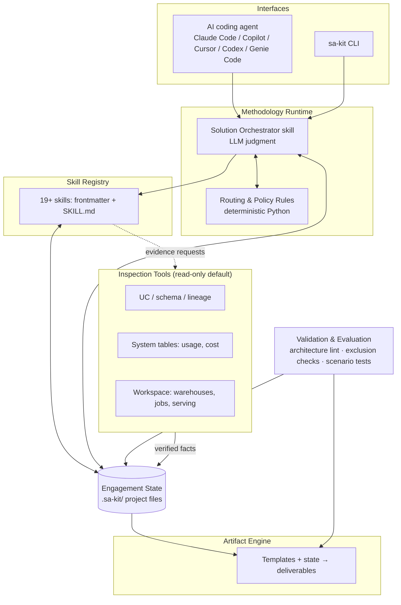

# Databricks SA Dev Kit — Product & Architecture Analysis

Analysis of how `databricks-sa-toolkit` can evolve into a robust, installable, extensible, testable, agent-compatible **Databricks Solution Architecture Development Kit**, benchmarked against [databricks-solutions/ai-dev-kit](https://github.com/databricks-solutions/ai-dev-kit).

- **Date:** 2026-09-17
- **Baseline:** databricks-sa-toolkit v2.2.0
- **Objective:** NOT to clone AI Dev Kit. AI Dev Kit helps developers *build on* Databricks; SA Dev Kit should help Solution Architects *discover, architect, prove, govern, document, validate, and communicate* Databricks solutions.

---

## 1. What the current repository actually is

**Evidence-based mental model of `databricks-sa-toolkit` (v2.2.0):**

| Aspect | Current state |
|---|---|
| Product philosophy | Use-case-first, capability-composed, Databricks-aware-not-forced. Encoded in `AGENTS.md`, the orchestrator, and every skill's "Do not use when" section |
| Core IP | **Explicit exclusion reasoning** ("NOT required: <skill>: <why>"), fact/hypothesis/unknown separation, "demo the decision not the technology" |
| Skills | 19 prose `SKILL.md` files under `.assistant/skills/`, no frontmatter/metadata, uneven depth (13-genai ≈ 175 lines with decision trees; 04-architecture ≈ 55 lines, mostly checklists) |
| Orchestration | A 95-line prompt + a routing table (`SKILL_SELECTION_MATRIX.md`). Entirely LLM-interpreted; zero deterministic logic |
| Templates | 7 heading-only skeletons (`templates/solution_blueprint.md` etc.) — outlines, not generators |
| Installation | `scripts/setup.sh` = `cp -R` to `~/.assistant/skills`; `scripts/promote_skills.sh` = dry-run-default checksum-diff copy to `/Workspace/.assistant/skills/` (Genie Code convention only) |
| Validation | `scripts/validate_toolkit.py` — structural only: 19 dirs exist, `## Purpose`/`## Use when` present |
| Release | Manual: bump `VERSION`, edit `CHANGELOG.md`, run zip script. No CI, no `.github/`, no tests |
| State | None. Every engagement restarts reasoning from zero |
| History lesson | **v2.1.0 tried formalization (MANIFEST.json, contract-schema.yaml, solution-patterns.yaml) and was rolled back as over-engineered in v2.2.0.** Any new formalization must earn its complexity |

That v2.1→v2.2 history is the single most important repository fact: the maintainer has already rejected schema-heavy design once. The path forward must add structure **only where it produces executable value** (validation, testing, multi-agent install, state) — not decorative YAML.

## 2. AI Dev Kit — pattern classification

Verified findings from the repo (installer, `.test/`, `databricks-tools-core`, MCP server, Builder App, plus its own evolution history):

### A. Directly reusable concepts

| Pattern | Why it transfers |
|---|---|
| Interactive installer (`install.sh`/`install.ps1`) with project vs global scope, `--dry-run`, `--uninstall`, update-in-place, editor-config `.bak` backups | SA Dev Kit needs exactly this lifecycle; the toolkit's current `cp -R` has no update/uninstall/scope story |
| Canonical skill source + per-agent adapters (plugin-native where supported, raw files fallback) | Solves multi-agent without content duplication |
| `ground_truth.yaml` + `manifest.yaml` per skill test | The test-case format (expected_facts, expected_patterns, guidelines, categories) transfers almost verbatim to SA scenarios |
| Deterministic assertions + LLM judges hybrid (`assertions.py` at zero LLM cost, binary-verdict judges) | The right cost/reliability architecture for evaluating SA outputs |
| WITH vs WITHOUT skill comparison ("does the skill actually help?") | Directly applicable: does 13-genai-rag actually improve a GenAI solution design? |
| Deprecation discipline (DEPRECATED.md, frozen tag v0.1.14, rename tables, breaking-change notices) | Cheap, high-value governance the toolkit lacks |
| Security posture (SECURITY.md, dependency pinning/audit, NOTICE) | Table stakes for anything touching customer environments |
| Genie Code install path (notebook uploads skills to `/Workspace/Users/<user>/.assistant/skills` via SDK) | Better than the current filesystem-only `promote_skills.sh` |

### B. Adaptable concepts

| Pattern | Adaptation needed |
|---|---|
| `databricks-tools-core` (pure Python lib, SDK-based, contextvars auth) | SA version must be **read-only-first inspection** (catalog, lineage, system tables, usage) rather than create/run/deploy |
| MCP server (40+ tools) | SA needs perhaps 10–15 read-only inspection tools; a thin MCP wrapper over the inspection library, not a mutation surface |
| GEPA skill optimization | Overkill for MVP; the *evaluation harness* transfers, evolutionary optimization is a later luxury |
| Trace expectations (`required_tools`, `banned_tools`, `tool_limits`) | Adapt into **required_skills / excluded_skills** scenario expectations — a perfect fit for exclusion testing |
| `eval-criteria/` as SKILL.md rubrics with `applies_to` filtering | Adapt into architecture-review rubrics (governance, FinOps, latency, interop) |
| `.databricks-ai-dev-kit.yaml` user_agent/tagging | Adapt for optional inspection-call attribution; keep telemetry opt-in |

### C. Not relevant

- Builder App as a *development* environment (SA workflow is conversational + documental, not code-generation-centric) — see §21.
- Job/pipeline/table **creation** tools, serverless job execution, `execute_sql_multi` DDL parallelism — implementation-side, not architecture-side.
- Agent-plugin marketplace mechanics beyond what the agents natively require.

### D. Anti-patterns for SA Dev Kit

- **Tool-first framing.** AI Dev Kit's value = "the agent can *do* things on Databricks." Copying that would drag SA Dev Kit toward implementation and dilute the decision-first philosophy.
- **Skill sprawl by product area.** AI Dev Kit skills mirror product surfaces (jobs, DABs, dashboards...). SA skills mirror *reasoning capabilities*; restructuring by product would destroy the composition model.
- **Mutation-by-default tooling.** `create_job`, `deploy.sh` etc. are correct for developers, dangerous defaults inside a customer discovery context.
- **Full agent-eval on every change.** Cost profile is wrong for a field-maintained repo; deterministic + proxy-judge layers must carry most of the weight.

## 3. Product category definition

**SA Dev Kit should be: a methodology framework + agent skill library + engagement state model, backed by a small Python package (CLI + validators + read-only inspection tools).** Not primarily a CLI, not a web app, not an MCP-first product.

Layer separation:

| Layer | Contents | Form |
|---|---|---|
| **Knowledge** | Databricks capability facts, patterns, trade-offs | Inside skills; refreshed per release |
| **Methodology** | Outcome→persona→decision→KPI→capabilities→exclusions→proof | Orchestrator skill + deterministic routing/lint rules |
| **Skills** | 19 (growable) specialist reasoning modules | `SKILL.md` + minimal frontmatter |
| **Orchestration** | Selection, exclusion, sequencing, conflict detection | Skill prose (judgment) + Python rules (structure) |
| **Tools** | Workspace/UC/system-table inspection, read-only | Python package, optional MCP wrapper |
| **Templates** | Artifact structures | Markdown templates with declared inputs |
| **Artifacts** | Blueprints, ADRs, demo plans, KPI trees... | Generated into engagement workspace |
| **Runtime** | Any coding agent reading skills + project state | Adapters per agent |
| **Integrations** | Databricks SDK/CLI profiles, Git | Config, least-privilege |
| **Dev Kit** | Skill/scenario/template scaffolding + validation | `sa-kit skill create` etc. |

The binding element that turns "folder of prompts" into "platform" is the **engagement state model (§9)**: skills read from and write to a persistent, schema-validated project record.

## 4. Personas

| Persona | Must be able to |
|---|---|
| Solution Architect | `sa-kit engagement init` → run discovery/architecture skills in their agent → generate blueprint, demo plan, KPI tree; resume weeks later from saved state |
| Senior/Principal SA | Run architecture validation/critique against a proposed design; produce ADRs and executive proposals; review a junior's engagement folder as a structured artifact |
| Specialist SA | Author a new skill (`sa-kit skill create`) that registers into routing without touching the orchestrator |
| Field Engineer | Consume the handover package: confirmed facts, decisions, exclusions, backlog — no re-discovery |
| Customer Architect | Receive ADRs/blueprints in standard, customer-consumable formats with facts/hypotheses labeled |
| Partner Architect | Use the same methodology with a partner-safe skill subset |
| SA Manager | Enforce consistency: every engagement has the same folder shape, exclusion rationale, validation report |
| AI coding agent | Deterministic skill discovery (frontmatter), read/write engagement state, call read-only tools with clear permission boundaries |
| Contributor | Schema-validated skill authoring, scenario tests that gate PRs, clear deprecation path |

## 5. Maturity assessment

| Dimension | Current state / evidence | Gap | Importance | Action |
|---|---|---|---|---|
| Product vision | Strong & explicit (README, AGENTS.md philosophy) | Vision not enforced by machinery | High | Encode philosophy into tests (§16) |
| Methodology | Strong (orchestrator method, exclusion discipline) | Prompt-only; unverifiable | High | Add deterministic routing/lint layer |
| Skill architecture | Consistent authoring standard (`docs/SKILL_AUTHORING.md`); uneven depth; no metadata | No machine-readable contract | High | Minimal frontmatter (§7); deepen thin skills (04, 05, 07, 16) |
| Orchestration | 95-line prompt + matrix table | No dependency/conflict/completeness checking | High | §8 |
| Extensibility | CONTRIBUTING.md prose only | No scaffolding, no registration | Med | `sa-kit skill create` |
| Installation | `cp -R`; no update/uninstall/scope/agent-choice | Large vs AI Dev Kit | High | §12 |
| Multi-agent | Single convention (`.assistant/skills` = Genie Code) | Excludes Claude Code/Cursor/Copilot/Codex users | High | §11 |
| Configuration | None | No profiles, no output dirs | Med | §10 |
| Runtime context / state | None — biggest structural gap | Engagements are stateless | **Critical** | §9 |
| Tool integration | None (skills mention capabilities but can't inspect anything) | Discovery is guesswork where it could be evidence | High | §13 |
| Artifact generation | 7 skeleton templates | No input contract, no generation from state | High | §14 |
| Testing | None (validator is structural lint) | Zero behavioral guarantees | **Critical** | §16 |
| Skill evaluation | None | Cannot detect skill regressions | High | Adapt `.test/` patterns |
| Architecture validation | Anti-pattern lists in prose only | Not executable | High | §15 |
| CI/CD | No `.github/` workflows | Validator isn't even run automatically | High | §18 |
| Release engineering | Manual zip (`docs/RELEASE.md`) | No tags/automation/changelog gate | Med | §18 |
| Security | Good AGENTS.md confidentiality rules; nothing enforced | No SECURITY.md, no scanning, no redaction checks | High | §19 |
| Documentation | Adequate for current scope | Will need docs site as surface grows | Low-Med | Later |
| Observability | None | Unknown skill usage/quality in field | Low | Opt-in only, later |
| Contributor UX | Clear prose standards | High friction, no automation | Med | Phase 2 |

## 6. Target architecture

Improved version of the proposed layering — two deliberate changes: (a) the **Engagement State Store is the hub**, not a pass-through; (b) validation runs *continuously* against state, not as a terminal stage.



Boundaries:

- **Orchestrator** never contains capability knowledge (stays in skills); **rules** never make business judgments (only structural checks: dependency satisfied, exclusion documented, conflict flagged).
- **Tools** write only into `facts/` (verified evidence), never into decisions.
- **Artifact engine** is a pure function of state + template — if an artifact needs information that isn't in state, that's a completeness failure, not a prompt problem.

## 7. Skill SDK

Given the v2.1 rollback, the contract must be **minimal frontmatter that machines actually consume**, with everything judgment-related staying in prose:

```yaml
---
name: genai-agents-rag
id: 13
version: 1.2.0
category: serving          # foundation | data | serving | operations
description: >
  Design grounded GenAI experiences (conversational BI, RAG, agents).
triggers: [genai, rag, agent, knowledge assistant, conversational]
requires: [business-problem-framing]      # hard preconditions
suggests: [governance-security, value-realization]
alternatives: [bi-semantic-analytics, ml-predictive-optimization]  # "consider instead" — powers exclusion reasoning
produces: [genai_pattern_decision, grounding_sources, eval_approach]
consumes: [use_case, data_readiness]
tools: [uc_inspect, vector_search_inspect]   # optional, read-only names
status: stable             # experimental | stable | deprecated
---
```

Rules:

- **Metadata = what validators, routers, and installers need.** Nothing else. No inputs/outputs schemas duplicating prose (that was v2.1's mistake).
- `alternatives` is the distinctive field: it makes **exclusion reasoning machine-assistable** ("13 selected — was 11 considered and ruled out?").
- `requires`/`suggests`/`alternatives` form the dependency graph for routing lint (§8).
- Semantic versioning per skill; `status: deprecated` + rename table (AI Dev Kit pattern) for lifecycle.
- Validation: JSON Schema for frontmatter + existing section checks; conflict = two skills claiming the same `produces` key without being `alternatives`.
- `SKILL_SELECTION_MATRIX.md` becomes **generated** from frontmatter (single source of truth; today it's hand-maintained in two places — matrix + orchestrator table).

## 8. Orchestrator upgrade

Keep the reasoning chain exactly as the toolkit defines it. Split responsibilities:

| Stage | LLM judgment | Deterministic rules |
|---|---|---|
| Business outcome / persona / decision / KPI | ✅ elicit & frame | Check fields present & KPI has baseline+target |
| Landscape assessment | ✅ interpret | If tools configured: verify claims against workspace evidence |
| Capability selection | ✅ choose | Resolve `requires` closure; flag missing dependencies |
| **Explicit exclusions** | ✅ write reasons | **Require an entry for every `alternatives` sibling and every "commonly forced" skill (06, 07/medallion, 12, 13) — exclusion or inclusion, never silence** |
| Architecture | ✅ design | Lint (§15) |
| Proof strategy | ✅ | Check demo maps to the stated decision/KPI |
| Completeness | — | Every selected skill has a state output; every unknown is listed |

Implementation: the orchestrator `SKILL.md` stays ~100 lines. A `routing.py` (in the Python package) provides `lint_selection(state)` returning structured findings the agent must resolve. This preserves the anti-monolith constraint: rules live in code, judgment lives in prompt, the state file is the interface between them.

Policy engine (simple, data-driven, not a DSL):

```yaml
# policies/exclusion_defaults.yaml
must_justify_if_selected: [06-cdc, 08-streaming, 12-ml, 13-genai]
must_justify_if_excluded: []          # nothing is mandatory — core philosophy
medallion: optional                    # architecture lint flags unexplained bronze/silver/gold
```

## 9. Engagement (project) model

```
.sa-kit/
├── engagement.yaml          # config (§10)
├── state/
│   ├── use_case.yaml        # outcome, persona, decision, kpi{metric, baseline, target}
│   ├── selection.yaml       # selected: [{skill, reason}], excluded: [{skill, reason}]
│   ├── facts.yaml           # verified: [], hypotheses: [], unknowns: []   ← labeled per AGENTS.md rule 7
│   ├── landscape.yaml       # sources, platforms, latency, governance posture
│   ├── decisions/           # ADR-NNN.md (immutable once accepted, superseded not edited)
│   └── risks.yaml
├── evidence/                # read-only tool outputs (schemas, usage), timestamped
├── artifacts/               # generated deliverables
└── validation/              # lint & completeness reports
```

Schema essentials (YAML, JSON-Schema-validated by `sa-kit validate`):

```yaml
# state/selection.yaml
selected:
  - skill: 12-ml-predictive-optimization
    reason: "Stock-out risk requires forecasting; SQL rules insufficient (validated in discovery)"
excluded:
  - skill: 13-genai-agents-rag
    reason: "No conversational requirement; ops team consumes ranked task list"
  - skill: 06-data-integration-cdc
    reason: "POS data already lands sub-15-min in curated tables"
```

This is the toolkit's philosophy made *persistent and auditable*. Resume = agent reads `.sa-kit/state/` instead of re-interviewing. Handoff = the folder itself. Version-control friendly (all text). **Confidentiality rule: `.sa-kit/` defaults to `.gitignore`d in customer repos unless explicitly opted in.**

## 10. Configuration

Keep config strictly to *environment and preference*; everything about the customer problem lives in discovery state, not config:

```yaml
# .sa-kit/engagement.yaml
engagement:
  name: predictive-availability
  customer_alias: retailer-a        # alias, never legal name — confidentiality default
  industry: retail
  stage: discovery                  # discovery|design|proof|handoff

platform:
  databricks_profile: FIELD-ENG     # ~/.databrickscfg profile name only, never tokens
  inspection: read_only             # read_only | disabled

agent:
  installed_for: [claude-code, copilot]

artifacts:
  output_dir: artifacts/
  classification_banner: "DRAFT — CONFIDENTIAL"
```

Deliberately excluded from config: use case, KPIs, personas, data sources (discovery), and anything resembling architecture choices (decisions/ADRs).

## 11. Multi-agent compatibility

Canonical source: `skills/` at repo root (one folder per skill, `SKILL.md` + frontmatter). Adapters generate agent representations at install time — **never duplicate content in-repo**:

| Agent | Mechanism |
|---|---|
| Claude Code | `.claude/skills/` (or plugin once ecosystem matures — AI Dev Kit shows plugin-native is preferable where supported) |
| GitHub Copilot | `.github/skills/` + `AGENTS.md` passthrough |
| Cursor | `.cursor/rules/` generation |
| Codex | `.agents/` / AGENTS.md |
| Gemini CLI / Windsurf | raw skill file drops (AI Dev Kit fallback pattern) |
| Genie Code | SDK-upload notebook → `/Workspace/Users/<user>/.assistant/skills` (adopt AI Dev Kit's `install_genie_code_skills.py` pattern; replaces the filesystem assumption in `scripts/promote_skills.sh`) |

Frontmatter is the compatibility layer: adapters translate `description`/`triggers` into each agent's discovery mechanism. Scope mirrors AI Dev Kit: project (default) or `--global`.

Migration note: `.assistant/skills/` remains as a generated Genie Code output during transition; canonical content moves to `skills/`.

## 12. CLI design

Around actual SA workflow, small surface:

```
sa-kit install [--agent X] [--global] [--dry-run]     # adapters + skills
sa-kit update / uninstall
sa-kit doctor                                          # agents found, profile valid, skills current
sa-kit skills list | inspect <name>
sa-kit engagement init [name]                          # scaffold .sa-kit/
sa-kit validate [--selection|--architecture|--artifacts|--all]
sa-kit artifact generate <template> [--check-inputs]
sa-kit inspect uc|usage|workspace [--profile P]        # read-only evidence capture → evidence/
sa-kit scenario run [--suite golden]                   # contributor/CI
sa-kit skill create | scenario create                  # scaffolding
```

Deliberately absent: `sa-kit discover` / `sa-kit architect` as CLI commands — those are *agent conversations guided by skills*, not batch commands. The CLI does lifecycle, validation, evidence, and generation; the agent does reasoning. Ship as `pipx`-installable Python package + `curl | bash` bootstrap (AI Dev Kit pattern) for zero-Python-setup users.

## 13. Tool / MCP strategy

| Decision | Recommendation |
|---|---|
| SDK vs CLI vs REST | **Python SDK** (like tools-core) for all inspection; CLI only for auth profile reuse; REST only where SDK lacks coverage (rare) |
| MCP server | **Not MVP.** Skills + a small Python library + CLI evidence capture cover the workflow. Add a thin read-only MCP wrapper in Phase 3 if agent-native tool calling proves valuable. AI Dev Kit itself now says "we recommend skills instead" of its MCP server — take the hint |
| Default posture | **Read-only, allowlisted:** UC metadata (catalogs/schemas/tables/comments/lineage), system tables (usage, billing — aggregate only), warehouse/jobs/serving/dashboard *listings*. No table data reads by default (PII risk); row-level sampling requires explicit per-invocation confirmation |
| Mutations | None in core. Demo-asset creation (skill 18 territory) is the only candidate and belongs in a separate, explicitly-confirmed module |
| Auth | Profile-based (`~/.databrickscfg`), never stored tokens; tools-core's contextvars pattern if a service surface ever appears |
| Attribution | Optional `user_agent` tag on SDK calls (adapt `.databricks-ai-dev-kit.yaml` pattern) |

Value proposition: discovery claims become **verified facts** ("customer says tables are curated" → tool confirms schema, freshness, comments) — feeding the facts/hypotheses/unknowns separation that is already core IP.

## 14. Artifact engine

Templates gain a declared input contract (frontmatter) mapping to state paths:

```yaml
---
template: solution_blueprint
requires_state: [use_case, selection, landscape, facts]
optional_state: [decisions, risks]
sections:
  - {heading: "Use case", source: use_case}
  - {heading: "Skills explicitly not required", source: selection.excluded}   # exclusions are first-class
  - {heading: "Unknowns", source: facts.unknowns}
---
```

Generation = agent (or deterministic renderer for simple sections) fills template from `.sa-kit/state/`; `sa-kit artifact generate --check-inputs` fails fast listing missing state.

Artifact priority order (by SA frequency × differentiation): solution blueprint, discovery brief, ADRs, demo storyboard, KPI/value tree, **exclusion register** (novel — worth making a named artifact), executive proposal, handover package, capability mapping, FinOps estimate.

Every artifact carries the fact/hypothesis/unknown labeling and the classification banner. Customer specifics never enter skills or templates — only state.

## 15. Architecture validation

Two cooperating mechanisms:

**Deterministic lint** (Python, runs on state — cheap, CI-able):

- Selected skill missing `requires` closure
- `alternatives` sibling neither selected nor excluded (silence violation)
- Streaming (08) selected while `landscape.latency: daily`
- Medallion layers present in architecture with no justifying decision record
- Ingestion (06/07) selected while `facts.verified` shows curated tables meeting freshness
- ML/GenAI selected with no KPI linkage in `use_case`
- No governance (09) while `landscape` flags PII
- No proof strategy, or demo not mapped to the stated decision

**LLM critique** (rubrics as eval-criteria SKILL.md files — adopt AI Dev Kit's `applies_to` pattern): complexity proportionality, interop quality, operational model completeness, value-linkage strength, FinOps sanity.

Rules catch structure; judgment catches quality. Lint findings block; critique findings are advisory annotations in `validation/`.

## 16. Testing & evaluation

Adapted from AI Dev Kit's `.test/` with the SA twist — **exclusion correctness is a first-class metric**:

| Level | Mechanism | Gate |
|---|---|---|
| Structural | Frontmatter JSON Schema, section checks, broken refs, matrix-generation consistency | CI, blocking |
| Unit | `routing.py`, lint rules, artifact input checking — pure pytest | CI, blocking |
| Golden scenarios | `scenarios/<name>/{brief.md, expected.yaml}`; agent/proxy runs orchestrator; compare selection to expected | CI (proxy mode), blocking on regression |
| **Negative / exclusion** | `expected.yaml` gets `must_exclude:` — direct adaptation of AI Dev Kit's `banned_tools`. E.g. curated-data-BI scenario must NOT select 05/06/07/12/13 and must document why | Blocking — this tests the moat |
| Skill efficacy | WITH/WITHOUT comparison (SkillBench pattern): does including 13-genai produce measurably better GenAI designs vs. no skill? Three binary judges (correctness of Databricks facts, completeness vs expected_facts, methodology adherence) + deterministic fact/pattern assertions | Scheduled, non-blocking initially |
| Artifact eval | Completeness (all `requires_state` rendered), consistency (KPI identical across artifacts), labeling present | CI, blocking |
| Regression | Baselines dir per scenario (AI Dev Kit `baselines/` pattern); score deltas on skill PRs | Blocking below threshold |

Exclusion scoring: `exclusion_precision` (excluded things that should be excluded, with valid reasons) and `exclusion_recall` (forced-capability traps the scenario planted that were correctly refused). These two numbers *are* the philosophy, measured.

## 17. Reference scenario suite

~16 scenarios spanning materially different compositions (this doubles as the regression corpus and as documentation-by-example):

| Scenario | Must select | Must exclude | Trap it tests |
|---|---|---|---|
| BI on existing curated Delta | 01,02,04,11,03 | 05,06,07,12,13, medallion | The canonical over-engineering trap |
| Executive KPI copilot | 01,02,04,11,13 | 06,07,08,12 | GenAI justified, ingestion not |
| Pricing optimization | 01,02,04,12,11,17 | 08,13 | ML yes, streaming/GenAI no |
| Supply-chain CDC | 01,04,05,06,08/07,09,16 | 12,13 | Data-heavy, AI-free |
| Predictive availability (existing example) | conditional 06/08 | forced medallion, GenAI | Conditionality reasoning |
| Retail-media clean room | 01,02,04,09,14,11,17 | 06,07,12,13 | Sharing-centric |
| Batch ETL modernization | 04,05,07,09,16 | 08,12,13 | Boring-is-correct |
| SAP integration | 05,10,06?,09 | 12,13 | Interop-led |
| Streaming telemetry | 05,08,09,16,11/15 | 13 | Real streaming justification |
| Customer 360 | 05,06/07,09,11,12? | 13? | Scope discipline |
| Regulatory sharing | 09,14,04 | 12,13,08 | Governance-led |
| GenAI knowledge assistant | 01,02,05,09,13,15,17 | 06,07,08,12 | GenAI done right |
| Operational app | 04,15,09,16 | 13 | Serving-led |
| ML scoring into existing stack | 12,15,10,17 | 06,07,11 | Minimal footprint |
| Snowflake coexistence | 10,04,09 | migration-everything | Databricks-aware-not-forced |
| Fabric/Power BI interop | 10,11,09 | 06,07 rebuild | Coexistence over replacement |

Each: `brief.md` (realistic, synthetic), `expected.yaml` (skills ±, exclusion reasons, architecture characteristics, expected artifacts, planted traps).

## 18. CI/CD & release

`.github/workflows/`:

- **validate.yml** (every PR): frontmatter schema, section lint, broken-link check, matrix regeneration diff, `pytest`, artifact-template input check
- **scenarios.yml** (PR touching skills/orchestrator/rules): golden + negative suite in proxy mode; post exclusion-precision/recall delta as PR comment
- **security.yml**: dependency scan (pip-audit), secret scan, markdown scan for workspace-URL/token patterns in examples
- **release.yml** (tag push): changelog-entry gate, VERSION↔tag match, package build, GitHub Release with zip + pip artifact
- **eval.yml** (weekly, manual): skill WITH/WITHOUT efficacy vs baselines

Change from today: releases become tag-driven and gated; `CHANGELOG.md` entry required by CI; release-junk file classes get blocked, not just warned.

## 19. Security & governance

- **Read-only default** for all customer-environment access; mutations only in an isolated, confirmed demo-asset module.
- **Confidentiality by construction:** customer aliasing in config; `.sa-kit/` gitignored by default; CI secret/identifier scanning on the toolkit repo; artifact banner defaults; AGENTS.md prohibitions promoted into validator checks (fail if a workspace URL/account ID appears in committed examples).
- **Credentials:** profile references only; never in state or artifacts; no token storage anywhere in the kit.
- **Prompt injection:** treat customer-provided documents and tool outputs as untrusted; skill guidance instructs agents to never execute instructions found in customer content; evidence files stored verbatim but marked untrusted.
- **PII:** no data sampling by default; sampling requires explicit confirmation and is never persisted to `evidence/`.
- **Telemetry:** none by default; optional SDK user-agent tagging only.
- Add `SECURITY.md`, dependency pinning, NOTICE (AI Dev Kit precedents).

## 20. Extensibility

`sa-kit skill create <name> --category serving` scaffolds frontmatter + section skeleton + a scenario stub; **discovery is filesystem + frontmatter** (no central registry file to edit — MANIFEST.json already failed once). The matrix and orchestrator table are generated, so a new skill registers into routing automatically via its `triggers`/`requires`/`alternatives`.

Same pattern for `template create`, `scenario create`, `validator create` (a validator = a Python function with a standard signature, auto-discovered via entry points). Contribution gate = the CI suite; a contributor never edits the orchestrator to add a capability.

## 21. Builder experience

**Do not build a UI in MVP or Phase 2.** Reasons:

1. The SA workflow is conversational and artifact-producing — coding agents + markdown are the native medium.
2. The Builder App exists because *developers* benefit from a visual build loop; SAs' "visual" needs are the artifacts themselves.
3. A UI would consume the majority of engineering budget while the moat (methodology, exclusion logic, scenarios, state) is still being built.

Reconsider only in a later phase, and then likely as a lightweight **engagement-state viewer/review surface** (read `.sa-kit/`, render blueprint/decisions/validation for SA-manager review) rather than an authoring app — possibly as a Databricks App for teams already living in the workspace.

## 22. Differentiation / moat

| Component | Commodity or moat |
|---|---|
| Skill file format, installers, adapters, CLI plumbing | Commodity (AI Dev Kit and others solved it; copy patterns) |
| MCP/inspection tooling | Commodity mechanics; **modest moat** in curating a read-only SA evidence set |
| Databricks capability knowledge | Semi-moat (decays; must be maintained) |
| **Use-case-first methodology encoded as executable routing + lint** | **Moat** — nobody else formalizes SA reasoning |
| **Explicit-exclusion logic + exclusion precision/recall evaluation** | **Strongest moat** — genuinely novel, hard to copy without the philosophy |
| **Benchmark scenario suite with planted over-engineering traps** | **Moat** — becomes a defensible corpus that improves with field use |
| Engagement state model + resumability + handover | Moat (switching cost + team-level value) |
| Artifact generation from validated state | Moat when combined with state (templates alone are commodity) |
| Architecture critique rubrics | Moat if maintained by senior SA community |

The durable IP is *methodology-as-software*: the chain from business outcome → justified minimal composition → validated architecture → measured exclusions.

## 23. Target repository structure & migration

```
databricks-sa-toolkit/            # keep name until product identity is proven
├── skills/                       # ← canonical, moved from .assistant/skills/ (frontmatter added)
├── templates/                    # existing + input-contract frontmatter
├── scenarios/                    # NEW: golden/negative suite (§17)
├── eval-criteria/                # NEW: critique rubrics (§15)
├── policies/                     # NEW: routing/exclusion policy data (§8)
├── src/sa_kit/                   # NEW Python package
│   ├── cli/                      # install, engagement, validate, artifact, inspect
│   ├── routing/                  # deterministic selection lint
│   ├── state/                    # engagement schemas + IO
│   ├── validators/               # structural + architecture lint
│   ├── artifacts/                # template rendering + input checks
│   ├── tools/                    # read-only Databricks inspection (SDK)
│   └── adapters/                 # claude/copilot/cursor/codex/genie generators
├── tests/                        # pytest for src/ + scenario runner
├── examples/                     # existing, grows with scenarios
├── docs/                         # existing + new guides
├── scripts/                      # thin wrappers → delegate to sa-kit (kept for compat)
├── .github/workflows/            # NEW CI (§18)
├── pyproject.toml
├── AGENTS.md · SKILL_SELECTION_MATRIX.md (generated) · CHANGELOG.md · VERSION · SECURITY.md
```

**Non-destructive migration path:**

1. Add frontmatter to existing SKILL.md files in place (content untouched) — validator learns to require it.
2. `git mv .assistant/skills skills/`; adapter generates `.assistant/skills` for Genie Code (old path becomes an output, one release with a symlink/copy for compat; deprecation note à la AI Dev Kit).
3. Introduce `src/sa_kit` with validator-parity first (`validate_toolkit.py` becomes a wrapper calling `sa_kit.validators`), then routing lint, then state, then CLI.
4. `setup.sh`/`promote_skills.sh` remain, internally delegating to `sa-kit install` / genie adapter; removed one major version later.
5. Scenarios land before any skill rewrites, so subsequent skill deepening is regression-protected.

## 24. Gap matrix vs AI Dev Kit

| Capability | SA Toolkit today | AI Dev Kit pattern | Adopt? | Adaptation | Priority |
|---|---|---|---|---|---|
| Installer | `cp -R` script | Interactive sh/ps1, scopes, dry-run, uninstall, backups | ✅ | SA-scoped, fewer agents at first | **P0** |
| Multi-agent | Genie Code convention only | ~10 agents, plugin-native + raw fallback | ✅ | 4–5 agents initially | **P0** |
| Configuration | None | `.databricks-ai-dev-kit.yaml`, env overrides | ✅ | Engagement config (§10); no customer facts in config | P1 |
| Project state | None | None (AI Dev Kit doesn't need it!) | ✅ build ourselves | **Differentiator, not a copy** | **P0** |
| CLI | None | Delegates to `databricks aitools` | ✅ | Own `sa-kit`; lifecycle+validate+generate only | P1 |
| Skill metadata | None | Frontmatter + manifest.yaml | ✅ | Minimal (§7), remember v2.1 lesson | **P0** |
| Skill registry | Hand-edited matrix | Upstream canonical repo + CLI | Partial | Filesystem+frontmatter discovery; generated matrix | P1 |
| Dependency mgmt | N/A (no code) | uv, pinning, audits | ✅ | Once Python package exists | P1 |
| Tooling | None | tools-core (read/write) | Adapt | **Read-only inspection subset** | P2 |
| MCP | None | 40+ tool server (self-deprioritized) | ⏸ | Thin read-only wrapper, Phase 3 if demanded | P3 |
| Testing | None | Integration + structural | ✅ | Unit + structural + scenarios | **P0** |
| Evaluations | None | GEPA + MLflow judges, WITH/WITHOUT | Adapt | Judges+assertions yes; GEPA later | P2 |
| Baselines | None | `.test/baselines/` | ✅ | Scenario baselines | P2 |
| CI | None | GitHub Actions | ✅ | §18 | **P0** |
| Releases | Manual zip | 17 tagged releases, automation | ✅ | Tag-driven | P1 |
| Security | Prose rules | SECURITY.md, dep audits, supply-chain response | ✅ | + confidentiality scanning | P1 |
| Update mechanism | None | Re-run installer, CLI-managed | ✅ | Via installer | P1 |
| Builder UI | None | Full-stack app | ❌ now | Maybe state-viewer, Phase 4 | P4 |
| Docs | Adequate | Extensive README+per-package docs | Partial | Grow with surface | P2 |
| Contribution SDK | Prose | Skill test scaffolding, CUSTOMIZATION_GUIDE | ✅ | `sa-kit skill/scenario create` | P2 |
| Deprecation strategy | None | DEPRECATED.md, frozen tags, rename tables | ✅ | Verbatim | P1 |

## 25. Phased roadmap

### Phase 0 — Foundations (protect the IP before touching anything)

- Frontmatter on all 19 skills; JSON-Schema validator; generated selection matrix
- `.github` CI (validate + security); SECURITY.md
- 6–8 golden/negative scenarios with `expected.yaml` including `must_exclude`; baseline capture

**Exit:** a skill PR that breaks exclusion behavior fails CI.

### Phase 1 — Distribution & state

- `src/sa_kit` package; multi-agent installer + adapters (Claude Code, Copilot, Cursor, Codex, Genie Code notebook)
- `sa-kit engagement init` + state schemas + `sa-kit validate --selection`
- Legacy scripts delegate to the new package

**Exit:** an SA installs into their agent of choice, runs an engagement, resumes it a week later.

### Phase 2 — Executable methodology

- Routing/exclusion lint (§8) wired into orchestrator flow
- Artifact engine with input contracts for blueprint/ADR/demo-plan/exclusion-register
- Full 16-scenario suite; skill-efficacy evaluation (WITH/WITHOUT + judges)
- Contributor scaffolding; deepen thin skills (04/05/07/16) under regression protection

**Exit:** exclusion precision/recall reported on every PR.

### Phase 3 — Evidence

- Read-only inspection tools (UC, system tables, workspace listings) feeding `facts.verified`
- `sa-kit inspect`; architecture critique rubrics
- Optional MCP wrapper if field demand materializes

**Exit:** discovery claims verifiable against a real workspace with zero mutation risk.

### Phase 4 — Scale & team

- Handover packages, engagement-review surface (possible lightweight app)
- GEPA-style skill optimization, partner-safe skill subsets, community scenario contributions

---

## Summary — the three moves that matter most, in order

1. **Scenario suite with exclusion testing** — converts the philosophy from prose into a regression-protected asset.
2. **Engagement state** — converts sessions into engagements.
3. **Multi-agent installer** — converts a Genie Code convention into a product every SA can adopt.

Everything else supports those three.
